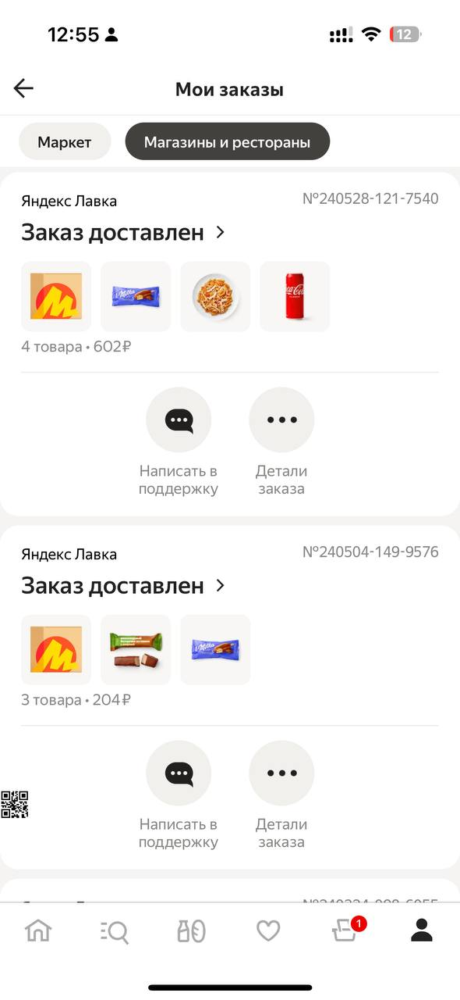

# Yandex Orders Screen Demo - Mobius Conference

## Introduction
Welcome to the Yandex Orders Screen Demo repository! This project demonstrates the creation and visualization of an Orders screen inside the Yandex Market application, showcased at the Mobius Conference.

## Platform Compatibility
This demo supports the following platforms:
- **Mobile:** iOS, Android, Flutter

## Yandex Market Orders Screen
In this demonstration, we create an Orders screen inside the Yandex Market application. This screen allows users to view, manage, and track their orders seamlessly.

### Features of the Orders Screen
- **Order List:** Display a list of all recent orders with basic details.
- **Filters:** Provide filtering options for users to sort and search their orders.

### Sample Orders Screen Layout

## License
This project is licensed under the MIT License. See the [LICENSE](LICENSE) file for details.
